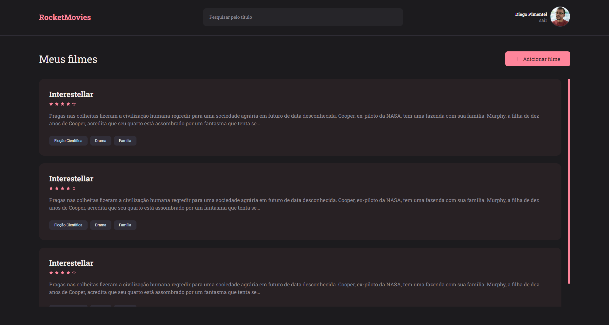

# RocketMovies (front-end)

## 💻 Sobre o projeto
Este foi um desafio proposto ao final do stage 9, no curso de Desenvolvimento Web [**Explorer**](https://www.rocketseat.com.br/explorer), da **Rocketseat**, com o objetivo de colocar em prática os conceitos aprendidos sobre o desenvolvimento de uma aplicação frontend utilizando React.

O projeto consiste em uma aplicação que permite o usuário cadastrar notas com reviews de filmes preenchendo com algumas informações (nome, descrição, nota) e criar tags relacionadas a eles.

No projeto foi utilizado o Vite.JS para criar o setup e também foi utilizado o conceito de "CSS in JS" com o Styled Components.

&nbsp;
## 🛠 Tecnologias
- HTML
- CSS
- JavaScript
- [Vite](https://vitejs.dev/)
- [React](https://react.dev/)
- [Styled Components](https://styled-components.com/)
